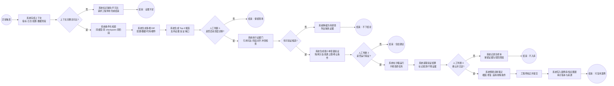

# TraceRoot 处理流程与分工设计

## 主流程图

## 节点分工

| 阶段 | 系统负责 | 工程师负责 | 产出 |
|---|---|---|---|
| 触发与冻结 | 监听阈值，保存异常前后窗口，记录数据血缘 | 确认实验范围（必要时） | 可复现上下文快照 |
| 条件化检索 | 按模型、阶段、checkpoint、代码版本筛选历史实验 | 无需逐步干预 | 可比实验集合 |
| Diff 与候选 | 计算四类 Diff，列 Top-3，绑定支持/反证 | 查看证据是否符合业务语境 | 候选根因卡片 |
| 证据门 | 检查引用权限、时间对齐、缺失字段、冲突证据 | 判断是否值得继续深挖 | 证据通过/降级状态 |
| 最小验证 | 生成唯一配置变更、资源上限、停止条件、回退路径 | 批准或取消 GPU 消耗 | 隔离验证任务 |
| 结论与沉淀 | 预填笔记、建立案例关系、写审计日志 | 校正根因、修复与适用条件 | 已确认案例或负样本 |

## 状态与恢复

`TRIGGERED → CONTEXT_FROZEN → EVIDENCE_READY → HYPOTHESES_READY → VALIDATION_PENDING → VALIDATING → EXPERT_REVIEW → LEARNED`

任意失败均转为 `NEEDS_DATA` 或 `BLOCKED`，保留现场快照和错误原因；不得自动跳到“已确认”。验证任务超时、资源异常或用户取消时，原任务状态保持不变。

## 人工打断控制

标准路径最多 3 次打断：启动深度诊断、运行验证、确认沉淀。指标检索、日志摘要、历史对照、引用校验等低风险步骤连续执行，避免把系统内部进度变成用户负担。

> 原型说明：`demo/index.html` 默认已选中 `EXP-1042` 并进入诊断现场，因此“是否启动深度诊断”在 Demo 中由入口选择隐含完成；验证沙箱与专家笔记两个高影响节点可直接操作。
